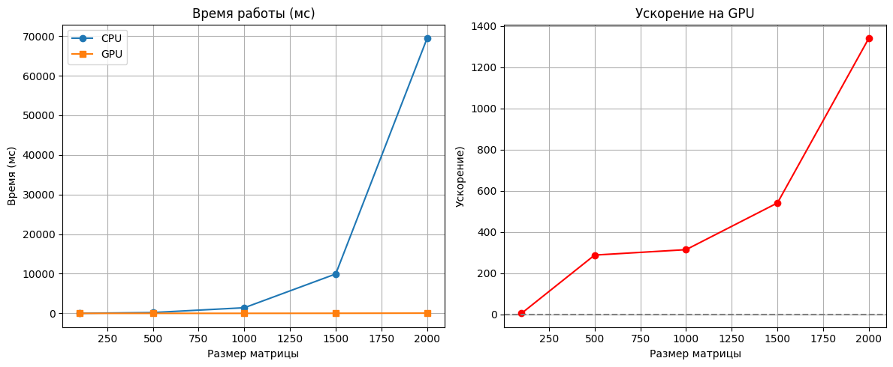
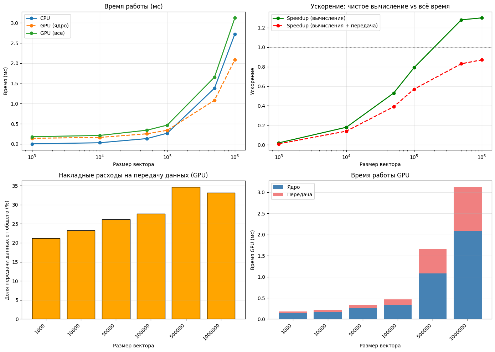
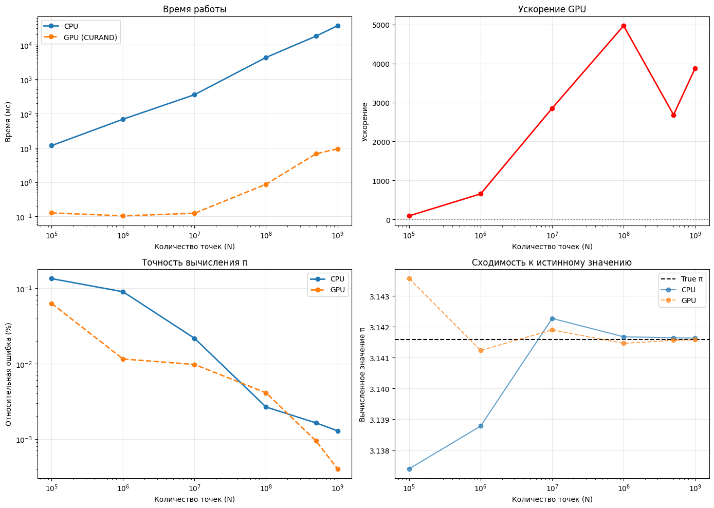
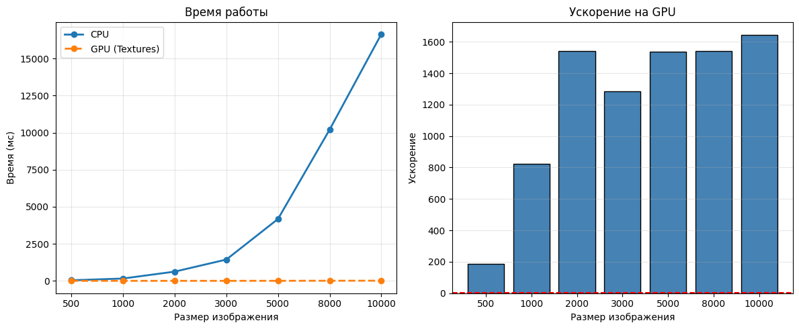
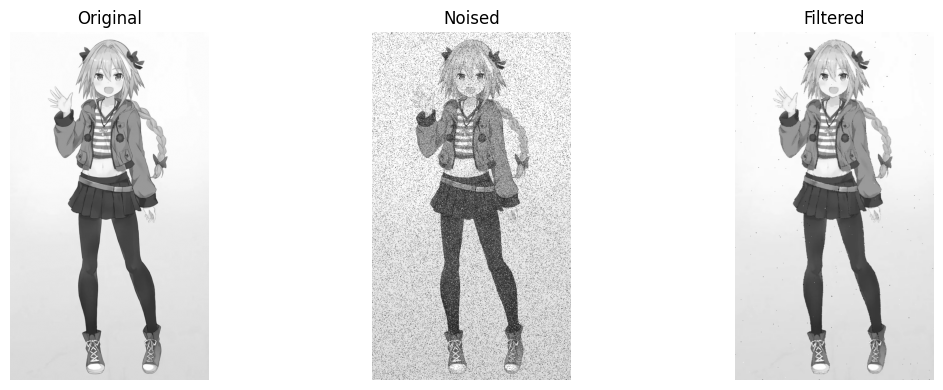

Сибряев Егор 6132

---

## Лабораторная работа 1: Перемножение матриц

### Задание
Реализовать алгоритм перемножения матриц размером от 100×100 до 2000×2000. Входные данные — две матрицы, выходные — результат перемножения, проверка корректности и время вычисления. Требуется реализовать две функции: на CPU и на GPU с применением CUDA.

### Реализация
- **CPU**: наивный алгоритм с тремя вложенными циклами (O(N³)).
- **GPU**: CUDA-ядро, где каждый поток вычисляет один элемент результирующей матрицы. Используется 2D-сетка блоков размером 16×16 потоков.
- **Проверка корректности**: поэлементное сравнение результатов CPU и GPU с допуском `1e-2`.
- **Замер времени**: `std::chrono` для CPU, `cudaEvent` для GPU.

### Что было распараллелено и почему
Каждый элемент результирующей матрицы Cᵢⱼ вычисляется независимо как скалярное произведение i-й строки матрицы A и j-го столбца матрицы B. Это позволяет назначить отдельный поток GPU для вычисления каждого Cᵢⱼ. Архитектура GPU (тысячи лёгких потоков, модель SIMT) идеально подходит для такой задачи.

### Результаты

| Размер | CPU (мс) | GPU (мс) | Ускорение |
|--------|----------|----------|-----------|
| 100    | 1.41     | 0.24     | 5.88      |
| 500    | 201.92   | 0.70     | 288.46    |
| 1000   | 1416.14  | 4.50     | 314.70    |
| 1500   | 9944.72  | 18.37    | 541.36    |
| 2000   | 69478.69 | 51.83    | 1340.51   |

Ускорение растёт с увеличением размера матрицы, так как накладные расходы на передачу данных по PCIe становятся незначительными по сравнению с объёмом вычислений (O(N³)).

---

## Лабораторная работа 2: Сумма элементов вектора

### Задание
Реализовать алгоритм сложения элементов вектора размером от 1 000 до 1 000 000 значений. Выходные данные: сумма элементов и время вычисления. Требуется реализовать две функции: на CPU и на GPU с применением CUDA.

### Реализация
- **CPU**: последовательный проход по вектору с накоплением суммы.
- **GPU**: каждый поток обрабатывает свою порцию элементов (grid-stride loop), локальная сумма накапливается в регистре, затем выполняется атомарное сложение в глобальную память через `atomicAdd`.
- **Замер времени**: два типа замера для GPU — только время ядра (`kernel`) и полное время с учётом передачи данных (`total`).

### Что было распараллелено и почему
Вектор разбивается на блоки, каждый поток обрабатывает элементы с шагом, равным общему числу потоков. Это обеспечивает равномерную загрузку и коалесцированный доступ к памяти. Атомарная операция `atomicAdd` собирает частичные суммы в один результат. Такой подход прост в реализации и достаточен для учебных целей.

### Результаты

| Размер | CPU (мс) | GPU ядро (мс) | Передача (мс) | GPU всего (мс) | Ускорение (ядро) | Ускорение (всего) |
|--------|----------|---------------|---------------|----------------|------------------|-------------------|
| 1 000  | 0.003    | 0.141         | 0.038         | 0.179          | 0.02             | 0.01              |
| 10 000 | 0.030    | 0.162         | 0.049         | 0.211          | 0.18             | 0.14              |
| 50 000 | 0.133    | 0.252         | 0.089         | 0.341          | 0.53             | 0.39              |
| 100 000| 0.267    | 0.338         | 0.129         | 0.467          | 0.79             | 0.57              |
| 500 000| 1.382    | 1.083         | 0.573         | 1.656          | 1.28             | 0.83              |
| 1 000 000| 2.724  | 2.089         | 1.034         | 3.123          | 1.30             | 0.87              |

На малых размерах вектора передача данных доминирует во времени выполнения, поэтому ускорение меньше 1. С ростом размера доля вычислений увеличивается, и ускорение приближается к теоретическому. Использование `atomicAdd` ограничивает максимальное ускорение из-за конкуренции за глобальную память.

---

## Лабораторная работа 3: Вычисление числа π методом Монте-Карло

### Задание
По заданному числу точек N сгенерировать случайное распределение в области (0,0)–(1,1) и вычислить число π с использованием CPU и GPU. Вывести значения π и время выполнения. Требуется использовать device API библиотеки CURAND для генерации случайных чисел на GPU.

### Реализация
- **CPU**: генерация точек через `rand()`, проверка условия x² + y² ≤ 1, накопление суммы.
- **GPU**: 
  - Инициализация генераторов CURAND через отдельное ядро `setup_curand`.
  - Основное ядро: каждый поток генерирует точки через `curand_uniform`, проверяет условие, накапливает локальную сумму.
  - Редукция: классическая tree-редукция в shared memory для суммирования результатов блоков.
- **Проверка**: сравнение относительной ошибки вычисленного π относительно эталонного значения.

### Что было распараллелено и почему
Генерация и проверка каждой точки независима, что позволяет назначить отдельный поток для обработки порции точек. Редукция в shared memory минимизирует обращения к глобальной памяти и избегает гонок, характерных для атомарных операций.

### Результаты

| N          | CPU (мс) | GPU (мс) | Ускорение | π (CPU) | π (GPU) |
|------------|----------|----------|-----------|---------|---------|
| 100 000    | 11.612   | 0.127    | 91.43     | 3.137400| 3.143560|
| 1 000 000  | 68.230   | 0.104    | 656.06    | 3.138784| 3.141232|
| 10 000 000 | 353.595  | 0.124    | 2851.57   | 3.142271| 3.141898|
| 100 000 000| 4303.181 | 0.866    | 4969.03   | 3.141676| 3.141464|
| 500 000 000| 17948.083| 6.691    | 2682.42   | 3.141644| 3.141563|
| 1 000 000 000| 36153.330| 9.327  | 3876.20   | 3.141633| 3.141580|

Ускорение достигает нескольких тысяч раз благодаря массовому параллелизму генерации точек. Точность обоих методов соответствует теоретической оценке ошибки Монте-Карло: O(1/√N).

---

## Лабораторная работа 4: Медианный фильтр для удаления шума "соль-перец"

### Задание
По заданному изображению в формате BMP с шумом "соль-перец" реализовать 9-точечный медианный фильтр на CUDA. Результат сохранить в BMP. Требуется использовать texture memory, обработка краёв — через взятие ближайших пикселей (clamp).

### Реализация
- **Загрузка/сохранение**: библиотека `stb_image.h` для чтения и записи BMP.
- **CPU**: наивная реализация с ручным clamp границ и сортировкой 9 элементов методом пузырька.
- **GPU**:
  - Создание `cudaTextureObject_t` с параметрами: `cudaAddressModeClamp` (автоматическая обработка краёв), `cudaFilterModePoint` (точная выборка пикселей).
  - Ядро: каждый поток обрабатывает один пиксель, через `tex2D` извлекает 9 соседей, сортирует, записывает медиану.
- **Генерация шума**: реализована на Python для воспроизводимости тестов.

### Что было распараллелено и почему
Обработка каждого пикселя независима, что позволяет назначить отдельный поток для каждого пикселя результата. Texture memory обеспечивает аппаратное кэширование 2D-локальных обращений, что критично для оконных фильтров. Режим clamp избавляет от ветвлений при обработке границ.

### Результаты

| Размер      | CPU (мс) | GPU (мс) | Ускорение |
|-------------|----------|----------|-----------|
| 500×500     | 38.32    | 0.21     | 186.00    |
| 1000×1000   | 156.13   | 0.19     | 821.74    |
| 2000×2000   | 621.77   | 0.40     | 1539.03   |
| 3000×3000   | 1435.54  | 1.12     | 1286.33   |
| 5000×5000   | 4172.73  | 2.72     | 1536.35   |
| 8000×8000   | 10204.67 | 6.62     | 1541.49   |
| 10000×10000 | 16640.77 | 10.12    | 1644.51   |

Ускорение превышает 1500× для изображений среднего и большого размера. Небольшое падение ускорения на 3000×3000 объясняется особенностями планировщика GPU и загрузкой памяти.

